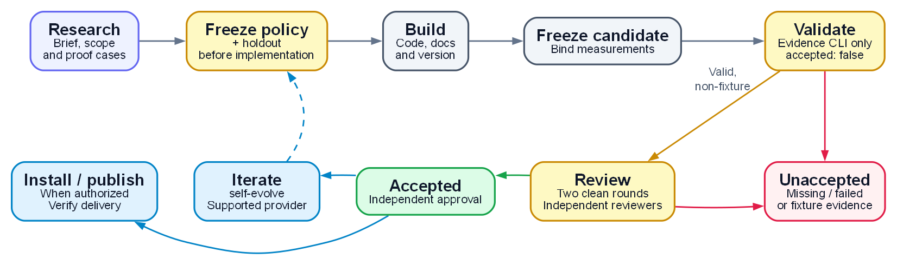

# skill-smith

Create focused skills through research, guarded scaffolding and independent review of measured evidence.

[](https://docs.anthropic.com/en/docs/claude-code)
[](LICENSE)
[](skills/skill-smith/reference/research-first.md)
[](skills/skill-smith/reference/acceptance-gate.md)
[](#languages)
[](ROADMAP.md)

[English](README.md) | [中文版](README_CN.md)

## ⭐ Read this first, the design philosophy

Generating a plausible SKILL.md does not establish that it triggers correctly or improves a task.
skill-smith therefore places research before generation and measured evidence after it. Research
defines the problem, alternatives and proof cases; an independent evaluator freezes policy and
holdout before implementation. The final candidate includes completed docs and version metadata.

Existing tools perform research, generation, evaluation and iteration. This orchestrator owns
their handoffs, guarded repository structure and evidence contracts. The tradeoff
is that missing evaluator capabilities remain visible blockers. A deterministic checker cannot
replace live measurements, and an artifact hash cannot authenticate a claimed result.

Acceptance needs independent approval of the same completed candidate and evidence.
See [PHILOSOPHY.md](PHILOSOPHY.md) for
the design choices and [the documentation contract](skills/skill-smith/reference/documentation.md)
for completion, review and release duties.

## What it does

- Route new single or batch skill creation through research, overlap checks and available generators.
- Emit a version-aligned skeleton with pinned Guards and Style submodules and fail-closed hooks.
- Validate evaluator G1/G2 scores and required G3-G8 artifacts against frozen policy and candidate.
- Measure whole-library budget and overlap, preserving missing inventory and listing evidence.
- Hand accepted evidence to an available self-evolve provider and verify requested installation or publication separately.

For an existing skill repair, use [self-evolve](https://github.com/DaizeDong/self-evolve). For finding
a ready-made skill, use [market-intel](https://github.com/DaizeDong/market-intel). Batch work still
needs evidence for each candidate and one shared library budget.

## Creation workflow

The workflow coordinates existing tools and independent evaluators. Each candidate in a batch
follows the same evidence and review path.

<p align="center">
  <a href="docs/diagrams/workflow-en.png"></a>
</p>

[Diagram source (DOT)](docs/diagrams/workflow-en.dot) · [Render PNGs](docs/diagrams/render.py)

The evidence CLI only validates supplied artifacts and always returns `accepted: false`.
Missing or failed gates, and bundles containing fixture evidence, leave the candidate unaccepted.
A changed candidate or policy requires fresh bound evidence and restarts both clean review rounds.
For an unchanged candidate and policy, collect missing evidence and validate again;
revisions return to the policy freeze.

Actual measurements come from evaluators outside the evidence CLI. The
[iteration handoff](skills/skill-smith/reference/iterate-handoff.md) uses an installed provider for
programmatic results (A), dated external anchors (B), or scenario/rubric/human or heterogeneous-judge
evidence (C), only when implemented and available. A scenario-eval design alone does not supply a
runnable evaluator; unavailable providers remain explicit gaps.

## Install

```text
/plugin install github:DaizeDong/skill-smith
```

For a source checkout:

```bash
git clone --recurse-submodules https://github.com/DaizeDong/skill-smith.git
cd skill-smith
git config core.hooksPath .githooks
python -m pip install -r requirements.txt
```

Keep both submodules initialized; an existing clone uses `git submodule update --init --recursive`.
Use a public-safe commit identity before contributing. Installed aliases and resource paths require
their own verification; see [deployment](skills/skill-smith/reference/deploy.md).

Python consumers can build and install the `skill_smith` catalog and runtime adapter package.
Optional execution uses installed llmcall, requires its 0.3.0 contract, and rejects requirements the
selected runtime cannot enforce. See the [Python API](skills/skill-smith/reference/python-api.md)
for dependencies, wheel building, source-path boundaries, coverage states and verification limits.

## Quick start

Ask “Use skill-smith to create a skill that performs this task,” or provide a series of distinct jobs.
Collect the [delivery brief](skills/skill-smith/reference/intake-delivery.md), research alternatives,
freeze evaluator policy/holdout, and assign the generation owner all applicable documents.

```bash
python skills/skill-smith/scripts/scaffold_skill.py my-skill --description "Create a reusable report from supplied public input." --topics "reporting"
python skills/skill-smith/scripts/check_conformance.py ../my-skill --stage draft
```

Draft checking does not establish acceptance. Complete implementation, both READMEs, philosophy,
SKILL, roadmap, changelog and applicable config/reference docs. Record document impact per affected
behavior. Run accepted-stage conformance before the final snapshot, then collect candidate-bound
evidence and independent review:

```bash
python skills/skill-smith/scripts/check_conformance.py ../my-skill
python skills/skill-smith/scripts/acceptance_gate.py --repo ../my-skill --snapshot
python skills/skill-smith/scripts/acceptance_gate.py --repo ../my-skill --manifest PRIVATE_MANIFEST --policy PRIVATE_POLICY --policy-sha256 FROZEN_SHA256
```

The evidence command validates contracts, prints JSON and exits nonzero pending independent review.
Synthetic bundles remain `synthetic_only`; supplied non-fixture attestations remain
`independent_review_required`. Two clean reviews bind the same candidate, policy and raw results.
Changes to code, docs, fixtures or metadata invalidate the previous snapshot and review streak.
The reviewer checks bilingual meaning and actual behavior, beyond structural documentation checks.

## Private run storage

Reports, real briefs, evaluator logs, worklists and backups belong in a verified PRIVATE versioned
companion. Public TOOL documentation contains reusable rationale and generated synthetic examples.
The source-owned [storage contract](storage.contract.json) defines retained paths and budgets;
keep current structured state, necessary configuration and recovery dependencies, and requested
final results. Extract unique useful changes before retiring superseded development material.
The [storage checker](skills/skill-smith/reference/storage-contract.md) reports declarations and
sizes without deleting data. Removal requires a reviewed plan and renewed checks of PRIVATE
identity, path boundaries and inactive writers.

From the tool checkout, substitute the account that owns your private companion:

```bash
gh repo create OWNER/skill-smith-config --private
gh repo clone OWNER/skill-smith-config ../skill-smith-config
printf 'skill-smith\n' > ../skill-smith-config/.companion
mkdir -p ../skill-smith-config/data
touch ../skill-smith-config/data/.gitkeep
git -C ../skill-smith-config add .companion data/.gitkeep
git -C ../skill-smith-config commit -m "Initialize private companion"
git -C ../skill-smith-config push -u origin HEAD
gh repo view OWNER/skill-smith-config --json visibility --jq .visibility
export SKILL_SMITH_CONFIG="$(cd ../skill-smith-config && pwd)"
```

For an existing companion, clone it and set the same variable. The visibility query must return
`PRIVATE`. Refresh the trusted visibility receipt before writing; the query does not update it.
See [runtime discovery and outputs](skills/skill-smith/reference/storage-contract.md#runtime-discovery-and-outputs)
for selection precedence, exact output paths, write admission, console-only operation and recovery,
and [Guards companion verification](guards/COMPANION.md#verifying-a-companion) for transport proof.
Smith owns runtime storage only; Profile Sync and operators initialize the external configuration
inputs listed in the storage reference. G8 conformance alone does not prove storage readiness.

## Library and fleet checks

Budget and dedup use the same user skills and active-plugin inventory. Override both with
`--skills-dir` and `--installed-plugins`. Missing, unreadable or conflicting entries remain
`UNKNOWN` with unresolved counts; stale cache versions do not count as active skills.
Budget requires a current captured `--listing FILE` to prove visibility. Historical capacity is
advisory; `--capacity N` supplies a current policy. Observed listing losses and projected removals
are separate. A removal decision remains BLOCKED; incomplete observations cannot produce G3 PASS.

`fleet_check.py` is read-only and checks aliases, local conformance, budget, DATA boundaries,
remote guard workflows and each default-branch workflow. `--offline` leaves remote rows unobserved.
Quote its coverage-bearing VERDICT, not only the failure count. Workflow inspection distinguishes
executed jobs from zero-step/no-runner failure without attributing an unproven cause.

Local conformance retains security and packaging checks and delegates structural documentation to
`style/tools/doc_contract.py --root . --profile skill --stage accepted`. A missing checker fails.
SKILL size warns above 12,000 characters and fails above 16,000, with existing dated shrink
exceptions reported explicitly. Required relative resources must resolve. These checks do not
establish live usefulness, remote CI or semantic correctness.

## Version and maintenance

The plugin manifest is the version source; both README badges, ROADMAP Current and latest numeric
CHANGELOG release stay aligned. Record meaningful later changes under Unreleased and preserve history.
The [documentation contract](skills/skill-smith/reference/documentation.md) is the rule's sole home.

```bash
python skills/skill-smith/scripts/bump_version.py . --level patch --dry-run
```

Follow the documentation contract for release preflight and preserved history, and the
[scaffold reference](skills/skill-smith/reference/scaffold.md#bump-version-preparation) for version
options. The tool aligns five surfaces and never commits, tags or pushes. Package releases also
need the aligned `pyproject.toml` version described in the Python API; preparation is not publication.

## Evidence and runtime prerequisites

Use Python 3.10+, Git and PyYAML from `requirements.txt`. Model and agent work uses installed
`llmcall` current routing, timeout and fallback policy. Preflight the selected research, generation
and evaluator capabilities; unavailable capabilities remain explicit.

For the offline suite, install `requirements-dev.txt`. Git's POSIX `sh` must be on PATH. On Windows,
use Git Bash or add Git for Windows' `bin` directory for the current shell:

```bash
python -m pip install -r requirements-dev.txt
python -m pytest -c pytest.ini tests/ tools/ -q -ra
```

Tests use local mirrors of checked-out kit revisions and forbid network Git protocols. Generated
fixtures exercise contracts; they cannot prove real task improvement or live integration.

## Limitations

G8 uses explicit source-owned applicability and declared native lifecycle paths. Static checks leave readiness unmeasured;
`--run-synthetic` opts into inspected fixture commands, with separate blank-template, deterministic
generation and configured A/B results. Scenario-eval and external providers must actually exist to be selected.
Same-account private paths provide procedural separation, not proven read denial. Installation,
publication, external readiness and actual outcomes each need their own observed evidence.

## Languages

English (`README.md`) · 中文 (`README_CN.md`). Both describe the same current contract.

## Roadmap · License

See [ROADMAP.md](ROADMAP.md) · [LICENSE](LICENSE) (MIT).
